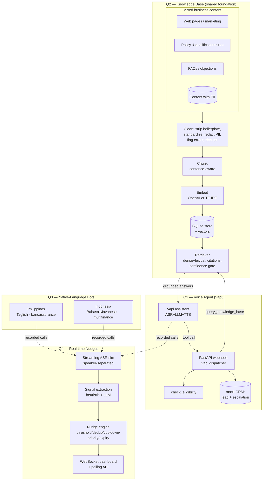

# VoxInsight — Architecture

The **Q2 knowledge base** is the shared foundation. The **Q1 voice agent** queries
it live for grounded answers. **Q3** reuses the same voice-platform pattern for
localized markets. Recorded calls from **Q1/Q3** feed **Q4**'s real-time pipeline.

## Key design decisions

| Decision | Why |
|---|---|
| SQLite + in-memory cosine for the KB | Zero external services, durable & traceable records; swap for FAISS/pgvector at scale |
| TF-IDF offline fallback for embeddings | Whole RAG pipeline runs and is testable with **no API keys**; OpenAI is a quality upgrade, not a hard dependency |
| Grounding via a confidence floor | Below the floor the agent refuses instead of hallucinating — directly targets the "hallucinated answers" rejection condition |
| PII excluded from retrieval | PII-flagged records are stored for audit but never ground a customer answer |
| Voice tools via webhook, not prompt | FAQs/policies live in the KB (Q2), satisfying "do not hardcode all FAQs in the system prompt" |
| Localization as config objects (Q3) | Terminology, code-switching, and localization-vs-translation examples are explicit and reviewable |
| Heuristic-first signals (Q4) | Fast, deterministic, cheap for real-time; LLM augments but never blocks critical nudges |
| Nudge control layer (Q4) | Thresholds/dedup/cooldown/expiry defend against "excessive low-value alerts" |

## Shared modules (`shared/`)
- `config.py` — env-driven settings; `has_openai` gates quality vs offline.
- `pii.py` — regex PII scan/redact (email, phone, card, SSN, PAN).
- `logging_utils.py` — consistent logging.
